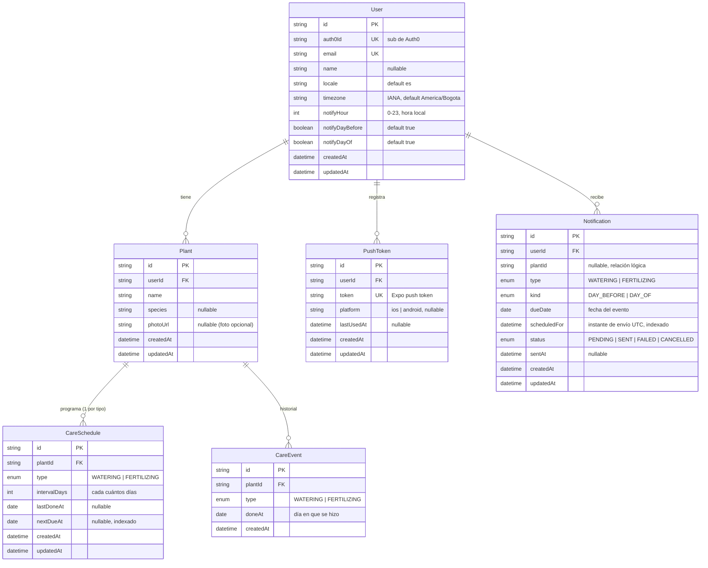

# 06 · Diagrama entidad-relación (ER)

> Generado el 2026-07-14 a partir de [`../prisma/schema.prisma`](../prisma/schema.prisma).
> La explicación de cada decisión está en [`04-data-model.md`](04-data-model.md).
> El diagrama usa sintaxis **Mermaid** (se renderiza en GitHub, VS Code y la mayoría de editores Markdown).

## Cardinalidades (resumen)

```
User 1───N Plant 1───N CareSchedule   (única por [plant, type])
                └──────N CareEvent     (log histórico del calendario)
User 1───N PushToken
User 1───N Notification  (N───1 Plant, relación lógica opcional)
```

## Diagrama



## Constraints e índices relevantes

| Modelo | Restricción | Propósito |
|---|---|---|
| `CareSchedule` | `@@unique([plantId, type])` | Un solo horario por tipo de cuidado y planta. |
| `CareSchedule` | `@@index([nextDueAt])` | El worker consulta "qué vence pronto" barato. |
| `CareEvent` | `@@index([plantId, doneAt])` | Alimenta el calendario por planta y fecha. |
| `Notification` | `@@unique([plantId, type, kind, dueDate])` | **Idempotencia**: el cron no duplica avisos. |
| `Notification` | `@@index([status, scheduledFor])` | Encontrar pendientes que ya deben salir. |
| `User` | `auth0Id` UK, `email` UK | Identidad vía Auth0. |
| `PushToken` | `token` UK | Un token por dispositivo. |

## Notas

- Todas las relaciones `User→*` y `Plant→*` usan `onDelete: Cascade`.
- `Notification.plantId` es una **relación lógica opcional** (no FK dura en el esquema actual),
  para que un aviso pueda sobrevivir aunque su planta cambie; se resuelve por aplicación.
- Fechas de calendario en `@db.Date`; instantes en `@db.Timestamptz(6)` — clave para la lógica
  de "día antes / mismo día" en la zona horaria del usuario.
